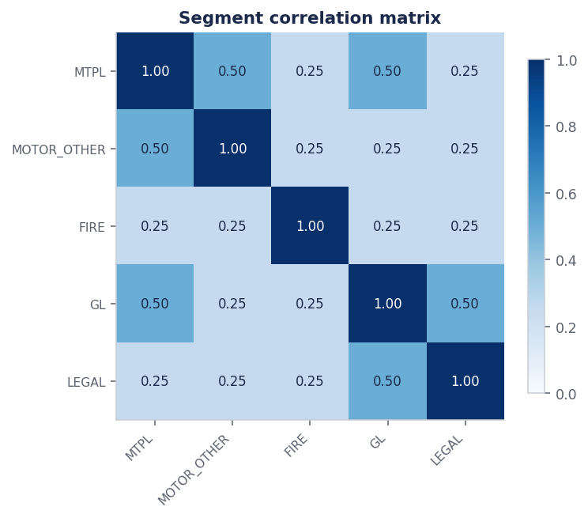
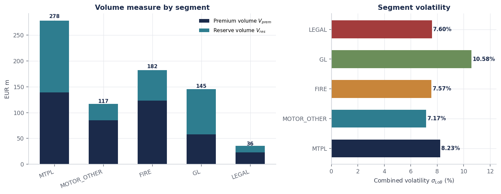
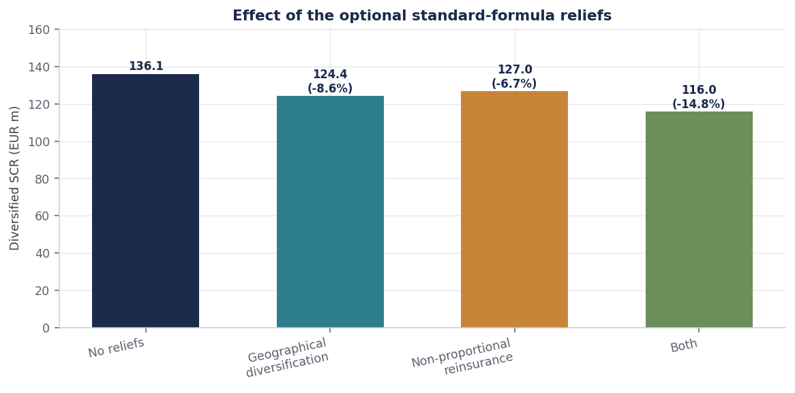

# Non-Life Premium & Reserve Risk SCR — Solvency II Standard Formula

*A study of diversification and capital allocation across five underwriting
segments, for a synthetic non-life insurer, Aurelia Insurance S.p.A.*

---

## Contents

Disclaimer: The entity names (Aurelia Insurance) and all corporate structures used in these projects are strictly for illustrative and demonstration purposes. They do not represent a real insurance company.

**Part I — The study**

1. [Introduction and research framework](#1-introduction-and-research-framework)
2. [Research design: why these five segments?](#2-research-design-why-these-five-segments)
3. [Data and methodology](#3-data-and-methodology) · [3.1 Data](#31-data) · [3.2 Overview of the framework](#32-overview-of-the-framework)
4. [Empirical results](#4-empirical-results)
5. [Discussion](#5-discussion)
6. [Conclusion](#6-conclusion)
7. [Limitations and future research](#7-limitations-and-future-research)

**Part II — The repository**

8. [Repository structure](#8-repository-structure)
9. [Cross-validation](#9-cross-validation)
10. [Running the analysis](#10-running-the-analysis)
11. [References](#11-references)

---

# Part I — The study

## 1. Introduction and research framework

The Solvency II standard formula computes the capital requirement for non-life
underwriting risk as three standard deviations of a portfolio-level volatility,
aggregated across segments through a prescribed correlation matrix. The
mechanics are fully specified; what is not specified is how the resulting number
should be attributed back to the business that generated it.

That attribution problem is the subject of this study. A segment's *standalone*
capital charge — what it would require if held alone — is straightforward and
almost always wrong as a management figure, because the firm never holds a
segment alone. The relevant quantity is the segment's *marginal* contribution to
the diversified requirement, given the rest of the portfolio.

Three questions are addressed:

1. **How large is the diversification benefit**, and how is it distributed across
   segments?
2. **Does standalone capital rank segments the same way marginal capital does?**
   If not, pricing and portfolio steering based on standalone charges are
   systematically distorted.
3. **What do the optional regulatory reliefs actually deliver?** Geographical
   diversification and the non-proportional reinsurance adjustment are available
   but frequently omitted from teaching examples.

The correlation aggregation is a quadratic form, and the most likely defect in
implementing one — double-counting or dropping an off-diagonal pair — is
invisible to inspection because it still returns a plausible number. The study is
therefore built four times, in Python, R, SQL and Power BI, with a Monte Carlo
check on the aggregation itself.

---

## 2. Research design: why these five segments?

**Five segments rather than three.** The source exercise used three generic lines.
Three segments produce a 3×3 correlation matrix in which almost every pair is
adjacent, and the diversification result is dominated by a single number. Five
segments generate ten distinct pairs, enough for correlation *structure* — rather
than correlation *level* — to drive the outcome, which is the phenomenon under
study.

**Which five, and why.** The set is chosen so that the correlation matrix has
genuinely different rows rather than being near-homogeneous:

| Segment | Role in the design |
|---|---|
| Motor vehicle liability | Largest volume; correlates 0.50 with two other segments — the concentrator |
| Other motor | Correlates 0.50 with MTPL only; tests whether size or correlation dominates |
| Fire and other damage to property | Correlates 0.25 with everything; large but structurally independent |
| General liability | Highest volatility (14% premium, 11% reserve); reserve-dominated |
| Legal expenses | Smallest segment, 0.25 with almost everything — the pure diversifier |

Motor TPL and Legal expenses are the poles of the design. They differ in size by
a factor of eight and in correlation structure completely, so the gap between
their standalone and marginal charges isolates the effect being measured.

**Why the Motor TPL reserve is not invented.** The claims provision for that
segment — EUR 138.64m — is the output of the
[reserving project](../01-nonlife-reserving-chainladder). Taking it as given
rather than assuming a round number means the two studies describe one balance
sheet, and the reserve volume measure inherits a defensible derivation rather
than a stipulation.

**Geographical spread.** Regional shares across Italy, Iberia and France are
assigned so that the diversification factor $DIV$ varies meaningfully across
segments — from 0.4936 for Fire to 1.0000 for Legal expenses, which is written
entirely domestically. A portfolio with uniform geographical spread would render
the relief a constant and remove it from the analysis.

---

## 3. Data and methodology

### 3.1 Data

**Segment inputs** (`data/lob_inputs.csv`), EUR m:

| Segment | $P_{\text{last}}$ | $P_{\text{next}}$ | $FP_{\text{exist}}$ | $FP_{\text{future}}$ | PCO | $\sigma_{\text{prem}}$ | $\sigma_{\text{res}}$ | NP eligible |
|---|---:|---:|---:|---:|---:|---:|---:|:--:|
| Motor vehicle liability | 118.0 | 124.5 | 8.2 | 6.5 | 138.6 | 10% | 9% | yes |
| Other motor | 74.3 | 78.0 | 4.1 | 3.2 | 31.5 | 8% | 8% | no |
| Fire & property | 96.5 | 101.2 | 12.4 | 9.8 | 58.9 | 8% | 10% | no |
| General liability | 42.7 | 45.9 | 6.8 | 5.4 | 87.3 | 14% | 11% | yes |
| Legal expenses | 18.4 | 19.6 | 1.9 | 1.5 | 12.7 | 7% | 12% | no |

Total premium EUR 369.2m, total claims provisions EUR 329.0m.

**Correlation matrix** (`data/correlation_matrix.csv`):

| | MTPL | Other motor | Fire | GL | Legal |
|---|---:|---:|---:|---:|---:|
| **MTPL** | 1.00 | 0.50 | 0.25 | 0.50 | 0.25 |
| **Other motor** | 0.50 | 1.00 | 0.25 | 0.25 | 0.25 |
| **Fire** | 0.25 | 0.25 | 1.00 | 0.25 | 0.25 |
| **GL** | 0.50 | 0.25 | 0.25 | 1.00 | 0.50 |
| **Legal** | 0.25 | 0.25 | 0.25 | 0.50 | 1.00 |

Verified symmetric with unit diagonal and positive semi-definite (eigenvalues
0.3455, 0.6073, 0.8196, 0.9045, 2.3231; condition number 6.73).



**Regional shares** (`data/geographic_diversification.csv`): premium and reserve
shares across Italy, Iberia and France for each segment, 13 rows.

All company figures are invented. The volatility and correlation parameters
follow the structure of Delegated Regulation (EU) 2015/35, Annexes II and IV, and
should be verified against the current consolidated text before any use beyond
demonstration.

### 3.2 Overview of the framework

**Step 1 — Volume measures (Article 116).**

$$V_{\text{prem},s} = \max(P_s,\ P_{\text{last},s}) + FP_{\text{existing},s} + FP_{\text{future},s}
\qquad V_{\text{res},s} = PCO_s$$

Both are scaled by the geographical diversification factor, which can reduce the
volume measure by at most 25%:

$$V_s = (V_{\text{prem},s} + V_{\text{res},s})\,(0.75 + 0.25 \cdot DIV_s),
\qquad DIV_s = \sum_{r} \text{share}_{s,r}^{\,2}$$

A segment written entirely in one region has $DIV = 1$ and earns nothing; one
spread evenly across four regions reaches the floor of $DIV = 0.25$.

**Step 2 — Segment volatility (Article 117).** Premium and reserve risk aggregate
at a correlation of 0.5:

$$\sigma_s = \frac{\sqrt{(\sigma_{p,s} V_{p,s})^2 + \sigma_{p,s} V_{p,s}\,\sigma_{r,s} V_{r,s} + (\sigma_{r,s} V_{r,s})^2}}{V_{p,s} + V_{r,s}}$$

Where adequate excess-of-loss cover is in place, $\sigma_{p,s}$ is multiplied by
0.80 for eligible segments.

**Step 3 — Aggregation and capital.**

$$\sigma = \frac{\sqrt{\sum_s \sum_t \text{Corr}_{s,t}\, \sigma_s V_s\, \sigma_t V_t}}{V},
\qquad SCR = 3\,\sigma\,V$$

**Step 4 — Euler allocation.** Writing $x_s = \sigma_s V_s$, the charge
$3\sqrt{x'Cx}$ is homogeneous of degree one in $x$, so marginal contributions sum
exactly to the total:

$$SCR_s = x_s \frac{\partial\, SCR}{\partial x_s} = \frac{3\, x_s (Cx)_s}{\sqrt{x'Cx}},
\qquad \sum_s SCR_s = SCR$$

**Step 5 — Validation.** The quadratic form is checked by simulating 200,000
correlated draws through a Cholesky factor and comparing the standard deviation
of the portfolio total against the closed form.

---

## 4. Empirical results

### 4.1 Volume measures and segment volatility

| Segment | $V_{\text{prem}}$ | $V_{\text{res}}$ | $V_{\text{total}}$ | $\sigma_{\text{LoB}}$ | Standalone SCR |
|---|---:|---:|---:|---:|---:|
| Motor vehicle liability | 139.2 | 138.6 | 277.8 | 8.23% | 68.62 |
| Fire & property | 123.4 | 58.9 | 182.3 | 7.57% | 41.38 |
| General liability | 58.1 | 87.3 | 145.4 | 10.58% | 46.13 |
| Other motor | 85.3 | 31.5 | 116.8 | 7.17% | 25.12 |
| Legal expenses | 23.0 | 12.7 | 35.7 | 7.60% | 8.14 |
| **Total** | **429.0** | **329.0** | **758.0** | **5.99%** | **189.40** |

*EUR m.*



Note that the company volatility of 5.99% is *below every individual segment
sigma*. This is not an error — it is the diversification effect operating on the
volatility itself, and it is why the company figure cannot be obtained by any
kind of averaging.

### 4.2 Aggregation

| | |
|---|---:|
| Total volume measure $V$ | EUR 758.04m |
| Company volatility $\sigma$ | 5.99% |
| Sum of standalone charges | EUR 189.40m |
| **Diversified SCR** ($3\sigma V$) | **EUR 136.15m** |
| Diversification benefit | EUR 53.25m (**28.1%**) |


### 4.3 Capital allocation

| Segment | Standalone | Allocated | Credit | Share of SCR |
|---|---:|---:|---:|---:|
| Motor vehicle liability | 68.62 | 58.78 | **14.3%** | 43.2% |
| General liability | 46.13 | 34.27 | 25.7% | 25.2% |
| Fire & property | 41.38 | 23.83 | 42.4% | 17.5% |
| Other motor | 25.12 | 15.38 | 38.8% | 11.3% |
| Legal expenses | 8.14 | 3.89 | **52.3%** | 2.9% |
| **Total** | **189.40** | **136.15** | 28.1% | 100.0% |

*EUR m. Allocated column reconciles exactly to the diversified SCR.*


### 4.4 Optional regulatory reliefs

Geographical diversification factors:

| Segment | Regions | $DIV$ | Volume scalar |
|---|---:|---:|---:|
| Fire & property | 3 | 0.4936 | 0.8734 |
| General liability | 3 | 0.5641 | 0.8910 |
| Motor vehicle liability | 3 | 0.7115 | 0.9279 |
| Other motor | 3 | 0.7990 | 0.9497 |
| Legal expenses | 1 | 1.0000 | 1.0000 |

Effect on the requirement:

| Basis | SCR | vs. baseline |
|---|---:|---:|
| No reliefs | EUR 136.15m | — |
| Geographical diversification | EUR 124.40m | −8.6% |
| Non-proportional reinsurance | EUR 127.01m | −6.7% |
| **Both** | **EUR 116.01m** | **−14.8%** |



### 4.5 Sensitivity to premium volume

| Segment | −10% premium | +10% premium | Swing |
|---|---:|---:|---:|
| Motor vehicle liability | −3.114 | +3.189 | 6.303 |
| Fire & property | −1.557 | +1.611 | 3.168 |
| General liability | −1.503 | +1.545 | 3.049 |
| Other motor | −1.197 | +1.222 | 2.419 |
| Legal expenses | −0.199 | +0.204 | 0.403 |

*Change in diversified SCR, EUR m.*


---

## 5. Discussion

### 5.1 Standalone capital ranks segments incorrectly

The central result is the divergence between the standalone and allocated
columns in §4.3. Legal expenses sheds **52.3%** of its charge on aggregation;
Motor TPL sheds **14.3%**. The two segments are treated almost four times
differently by the same aggregation.

The driver is correlation structure, not size. Motor TPL correlates at 0.50 with
both Other motor and General liability — together 68% of the remaining volume —
so when Motor TPL deteriorates, a large part of the portfolio is expected to
deteriorate with it and aggregation forgives very little. Legal expenses
correlates at 0.25 with three of its four counterparts, so it absorbs capital the
portfolio was largely holding anyway.

The practical consequence is direct. A firm pricing off standalone charges
over-prices its diversifiers and under-prices its concentrators, and will
therefore tend to shed exactly the business that was reducing its capital
requirement. Because the Euler contributions are additive by construction, the
allocated column can be used for pricing and portfolio steering without any
reconciliation step — which is what makes it operational rather than merely
descriptive.

### 5.2 Segment volatility is not bracketed by its components

A natural expectation is that $\sigma_{\text{LoB}}$ should lie between
$\sigma_{\text{prem}}$ and $\sigma_{\text{res}}$. It does not. When the two are
equal, the formula collapses to

$$\sigma_{\text{LoB}} = \sigma \cdot \frac{\sqrt{3}}{2} \approx 0.866\,\sigma$$

— strictly below *both* inputs, because premium and reserve risk diversify
against one another at a correlation of 0.5 within the segment.

This is stated explicitly because the intuitive bracketing property was asserted
as a unit test during construction and failed. The test now asserts subadditivity
instead, and a second test verifies the $\sqrt{3}/2$ identity directly.

### 5.3 The reliefs are worth more than they appear

Neither relief is exotic, and together they are worth EUR 20.1m — 14.8% of the
requirement, and considerably more than the difference between any two
reasonable parameter choices elsewhere in the calculation.

The geographical relief is not uniform in its effect: it favours Fire and General
liability, which are spread across three regions, and delivers nothing to Legal
expenses, which is written entirely in Italy. This creates a capital incentive
for geographical expansion that is separate from any underwriting rationale, and
is worth being aware of when interpreting a firm's stated diversification
strategy.

### 5.4 What the Monte Carlo check is for

The closed form $\sqrt{x'Cx}$ agrees with a 200,000-draw Cholesky simulation to
0.09%, inside the 0.79% Monte Carlo tolerance. This is not a redundant test.

Simulating correlated normals and taking the standard deviation of the portfolio
total reproduces $\sqrt{x'Cx}$ by construction, so agreement confirms the
quadratic form was assembled correctly — specifically, that no off-diagonal pair
was double-counted or dropped. That is the single most likely defect in a
correlation aggregation and it is invisible to inspection, because the wrong
answer is still a plausible number. Three further structural tests bound the
result from other directions: setting every correlation to 1 must collapse the
SCR onto the undiversified sum; the identity matrix must give the
root-sum-of-squares; and under perfect correlation the Euler allocation must
return the standalone charges exactly.

---

## 6. Conclusion

The non-life premium and reserve risk requirement for Aurelia Assicurazioni is
**EUR 136.15m**, against EUR 189.40m undiversified — a diversification benefit of
**28.1%** — falling to **EUR 116.01m** once the geographical and non-proportional
reinsurance reliefs are applied.

Three findings carry beyond this portfolio:

1. **Standalone and marginal capital rank segments differently**, and the gap is
   driven by correlation structure rather than size. Legal expenses sheds 52% of
   its standalone charge, Motor TPL 14%.
2. **The optional reliefs are worth 14.8%** of the requirement, more than any
   plausible parameter disagreement elsewhere in the calculation.
3. **Company volatility falls below every segment volatility.** No averaging of
   segment sigmas can reproduce it — a naive average returns 8.23% against a true
   5.99%, a 37.5% overstatement, and is a live risk in any BI layer built over
   these figures.

---

## 7. Limitations and future research

**Parameters are illustrative.** Segment sigmas and the correlation matrix follow
the structure of Delegated Regulation (EU) 2015/35, Annexes II and IV, but must be
verified against the current consolidated text before any use beyond
demonstration.

**Premium and reserve risk only.** Non-life underwriting risk also comprises
lapse risk and catastrophe risk. Neither is modelled, so the figures here are the
largest component of the module rather than the module itself.

**Reinsurance is a factor, not a contract.** The non-proportional adjustment is
applied as the flat regulatory 80%. Whether an excess-of-loss programme qualifies
is a contractual assessment, not a calculation, and the standard formula does not
recognise the structure of the programme at all.

**Standard formula, not an internal model.** The multiplier of 3 embeds a
lognormal assumption calibrated to a 99.5% one-year VaR, and the correlation
matrix is a regulatory prescription rather than an estimate from the firm's own
experience. Whether either fits this portfolio is precisely the question an
internal model exists to ask.

**Defects found and fixed during construction:**

| Defect | Consequence had it shipped |
|---|---|
| `int64` dtype error on volume scaling | Sensitivity analysis crashed |
| `geographic_diversification_factor` misused `reset_index(name=)` | DIV computation failed |
| Test asserted sigma is bracketed by component sigmas | A false property, defended by a passing-looking test |
| `DECIMAL(18,2)` overflow when volumes squared in SQL | Aggregation aborted; resolved by casting to `DOUBLE` |

**Directions for future work.**

1. **Estimate the correlations.** With multi-line triangles, reserve-risk
   correlations could be estimated from the firm's own development residuals and
   compared against the prescribed matrix — the first step towards a partial
   internal model.
2. **Add lapse and catastrophe risk** to complete the underwriting module and
   allow a full non-life SCR.
3. **Cost-of-capital pricing.** With additive allocated capital, a
   risk-adjusted return on capital can be computed per segment and used to test
   whether the current portfolio mix is on the efficient frontier.
4. **Contract-level reinsurance modelling.** Replacing the flat 80% factor with
   an explicit XL structure would let the capital benefit of a specific programme
   be measured rather than assumed.

---

# Part II — The repository

## 8. Repository structure

```
├── data/
│   ├── lob_inputs.csv                  5 segments
│   ├── correlation_matrix.csv          5×5, PSD-verified
│   └── geographic_diversification.csv  regional shares
├── src/scr/
│   ├── premium_reserve.py              volumes, sigma, aggregation, Euler
│   └── viz.py                          chart production
├── R/scr_validation.R                  matrix rebuild + Monte Carlo check
├── sql/
│   ├── 01_schema_and_load.sql          schema, UNPIVOT, data-quality gate
│   └── 02_premium_reserve_scr.sql      SCR as a self-join quadratic form
├── powerbi/
│   ├── build_model.py                  star-schema export
│   ├── measures.dax                    DAX measure library
│   └── BUILD_GUIDE.md                  schema, relationships, report pages
├── tests/test_scr.py                   22 unit tests
├── outputs/figures/                    6 charts
├── outputs/tables/                     6 result tables
└── run_analysis.py
```

The SQL implementation is worth reading: $\sqrt{x'Cx}$ becomes a self-join over
the long-form correlation matrix, where every ordered pair contributes
`corr × x_i × x_j` to a single `SUM`. The matrix is loaded wide and normalised
with `UNPIVOT`, and the volume columns are cast to `DOUBLE` because
`DECIMAL(18,2)` overflows the instant two of them are multiplied.

## 9. Cross-validation

| Comparison | Result |
|---|---|
| Python vs. SQL, SCR and allocation | agree at every segment to displayed precision |
| Python vs. R, closed-form aggregation | identical |
| Closed form vs. Monte Carlo (200k Cholesky draws) | 0.09% relative, inside 0.79% tolerance |
| Euler contributions vs. total SCR | reconcile to < 1 × 10⁻¹² relative |
| SQL data-quality gate (5 assertions) | 0 failures |
| Unit tests | 22 passed |

## 10. Running the analysis

```bash
pip install -r requirements.txt

python run_analysis.py                 # full analysis, tables and figures
pytest -q                              # 22 tests
Rscript R/scr_validation.R             # independent rebuild + Monte Carlo

duckdb aurelia_scr.db < sql/01_schema_and_load.sql
duckdb aurelia_scr.db < sql/02_premium_reserve_scr.sql

python powerbi/build_model.py
```

Requires Python 3.11+, R 4.0+ (base only), DuckDB 0.10+.

## 11. References

Commission Delegated Regulation (EU) 2015/35, Articles 115–117 and Annexes II–IV.

EIOPA (2014). *The underlying assumptions in the standard formula for the
Solvency Capital Requirement calculation.* EIOPA-14-322.

Tasche, D. (2007). Euler allocation: theory and practice. *arXiv:0708.2542*.

Denault, M. (2001). Coherent allocation of risk capital. *Journal of Risk*,
4(1), 1–34.

---

*All company data in this project is fictional. The Motor TPL claims provision is
taken from the [reserving project](../01-nonlife-reserving-chainladder).*
