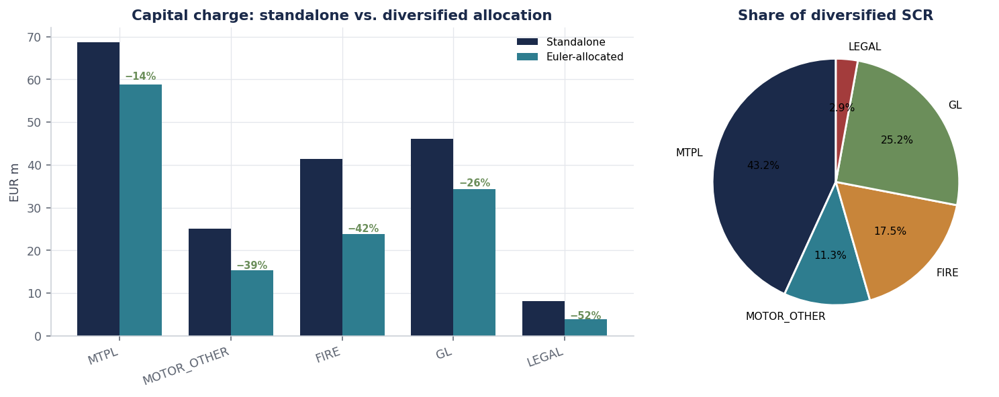
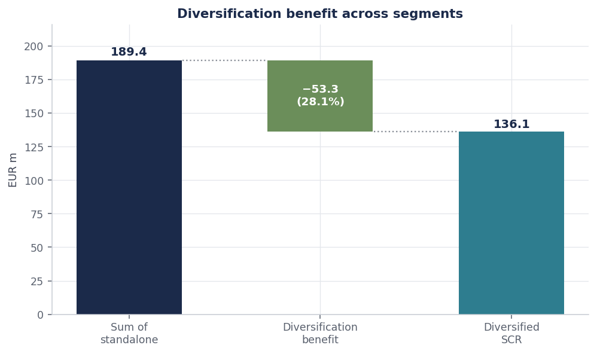
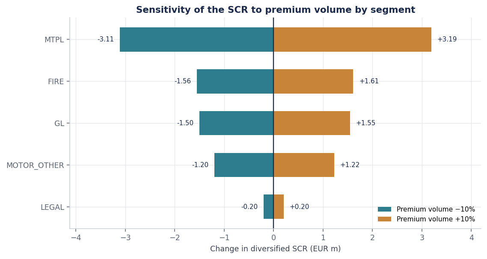

[README.md](https://github.com/user-attachments/files/30639019/README.md)
# Non-Life Premium & Reserve Risk SCR — Solvency II Standard Formula

Capital requirement for the non-life underwriting risk of **Kamal Insurance**, computed under the standard formula and implemented four
times — Python, R, SQL and Power BI — so each validates the others.

Five segments, EUR 758.0m of volume measure. The Motor TPL claims provision is
taken from the [reserving project](../01-nonlife-reserving-chainladder), so the
two repositories describe one balance sheet rather than two unrelated exercises.



---
Disclaimer: The entity names (Kamal Insurance) and all corporate structures used in these projects are strictly for illustrative and demonstration purposes. They do not represent a real insurance company.

## Headline result

| | |
|---|---:|
| Total volume measure *V* | EUR 758.04m |
| Company volatility σ | 5.99% |
| Sum of standalone charges | EUR 189.40m |
| **Diversified SCR (3 σ V)** | **EUR 136.15m** |
| Diversification benefit | EUR 53.25m (**28.1%**) |

Effect of the optional reliefs:

| Basis | SCR | vs. baseline |
|---|---:|---:|
| No reliefs | EUR 136.15m | — |
| Geographical diversification | EUR 124.40m | −8.6% |
| Non-proportional reinsurance | EUR 127.01m | −6.7% |
| Both | EUR 116.01m | **−14.8%** |

Euler allocation of the diversified charge:

| Segment | Standalone | Allocated | Credit | Share |
|---|---:|---:|---:|---:|
| Motor vehicle liability | 68.62 | 58.78 | 14.3% | 43.2% |
| General liability | 46.13 | 34.27 | 25.7% | 25.2% |
| Fire & property | 41.38 | 23.83 | 42.4% | 17.5% |
| Other motor | 25.12 | 15.38 | 38.8% | 11.3% |
| Legal expenses | 8.14 | 3.89 | 52.3% | 2.9% |

*EUR m. Allocated column sums exactly to EUR 136.15m.*

### The finding that matters

**Standalone capital is a bad guide to what a segment actually costs.** Legal
expenses looks like a 4.3% share of the book on a standalone basis; after
diversification it carries 2.9%, having shed 52% of its charge. Motor TPL loses
only 14%.

The reason is correlation structure, not size. Legal expenses correlates at 0.25
with almost everything, so it absorbs capital that the rest of the portfolio was
already holding. Motor TPL correlates at 0.50 with both Other motor and General
liability — the three move together, so aggregation forgives very little.

The practical consequence: pricing a segment off its standalone charge
systematically over-prices the diversifiers and under-prices the concentrators.
The Euler allocation is additive by construction — the contributions sum to the
diversified requirement exactly — which is what makes it usable for portfolio
steering rather than merely descriptive.

---

## Method

### Volume measures (Article 116)

$$V_{\text{prem},s} = \max(P_s,\ P_{\text{last},s}) + FP_{\text{existing},s} + FP_{\text{future},s}
\qquad V_{\text{res},s} = PCO_s$$

Both are scaled by the geographical diversification factor, which can reduce the
volume measure by at most 25%:

$$V_s = (V_{\text{prem},s} + V_{\text{res},s})\,(0.75 + 0.25 \cdot DIV_s),
\qquad DIV_s = \sum_{r} \left(\frac{\text{share}_{s,r}}{\ }\right)^2$$

A segment written entirely in one region has $DIV = 1$ and earns nothing; one
spread evenly across four regions reaches the floor of $DIV = 0.25$.

### Segment volatility (Article 117)

Premium and reserve risk aggregate at a correlation of 0.5:

$$\sigma_s = \frac{\sqrt{(\sigma_{p,s} V_{p,s})^2 + \sigma_{p,s} V_{p,s}\,\sigma_{r,s} V_{r,s} + (\sigma_{r,s} V_{r,s})^2}}{V_{p,s} + V_{r,s}}$$

Note this is **not** bracketed by the two component sigmas. When
$\sigma_p = \sigma_r = \sigma$ the expression collapses to
$\sigma\sqrt{3}/2 \approx 0.866\sigma$ — within-segment diversification pulls the
result below *both* inputs. There is a unit test for exactly this, because
asserting the intuitive bracketing property is a natural mistake.

### Aggregation and capital

$$\sigma = \frac{\sqrt{\sum_s \sum_t \text{Corr}_{s,t}\, \sigma_s V_s\, \sigma_t V_t}}{V},
\qquad SCR = 3\,\sigma\,V$$



### Euler allocation

Writing $x_s = \sigma_s V_s$, the charge $3\sqrt{x'Cx}$ is homogeneous of degree
one in $x$, so marginal contributions sum exactly to the total:

$$SCR_s = x_s \frac{\partial\, SCR}{\partial x_s} = \frac{3\, x_s (Cx)_s}{\sqrt{x'Cx}},
\qquad \sum_s SCR_s = SCR$$

---

## Cross-validation

| Comparison | Result |
|---|---|
| Python vs. SQL, SCR and allocation | agree to displayed precision at every segment |
| Python vs. R, closed-form aggregation | identical |
| Closed form vs. Monte Carlo (200k Cholesky draws) | 0.09% relative, inside the 0.79% MC tolerance |
| Euler contributions vs. total SCR | reconcile to < 1×10⁻¹² relative |

The Monte Carlo check is the one that earns its place. Simulating correlated
normals through a Cholesky factor and taking the standard deviation of the
portfolio total reproduces $\sqrt{x'Cx}$ by construction — so agreement confirms
the quadratic form was assembled correctly, and in particular that no
off-diagonal pair was double-counted or dropped. That is the single most likely
bug in a correlation aggregation, and it is invisible to inspection.

Three structural properties are also tested rather than assumed: setting every
correlation to 1 must collapse the SCR onto the undiversified sum; setting the
matrix to the identity must give the root-sum-of-squares; and under perfect
correlation the Euler allocation must return the standalone charges.

---

## What is in the repository

```
├── data/                     5 segments, correlation matrix, regional shares
├── src/scr/
│   ├── premium_reserve.py    volume measures, sigma, aggregation, Euler
│   └── viz.py                chart production
├── R/scr_validation.R        matrix rebuild + Monte Carlo cross-check
├── sql/
│   ├── 01_schema_and_load.sql    star schema, UNPIVOT, data-quality gate
│   └── 02_premium_reserve_scr.sql   full SCR as a self-join quadratic form
├── powerbi/                  star schema, DAX library, build guide
├── tests/                    22 unit tests
├── outputs/figures/          six charts
└── run_analysis.py
```

The SQL is worth a look: `sqrt(x'Cx)` becomes a self-join over the long-form
correlation matrix, where every ordered pair contributes
`corr × x_i × x_j` to a single `SUM`. The correlation matrix is loaded wide and
normalised with `UNPIVOT`, and the volume columns are cast to `DOUBLE` because
`DECIMAL(18,2)` overflows the instant two of them are multiplied.



---

## Running it

```bash
pip install -r requirements.txt

python run_analysis.py                 # full analysis, tables and figures
pytest -q                              # 22 tests
Rscript R/scr_validation.R             # independent rebuild + Monte Carlo

duckdb aurelia_scr.db < sql/01_schema_and_load.sql
duckdb aurelia_scr.db < sql/02_premium_reserve_scr.sql

python powerbi/build_model.py
```

---

## Notes and limitations

- **Parameters are illustrative.** The segment sigmas and the correlation matrix
  follow the structure of the standard formula as set out in Delegated
  Regulation (EU) 2015/35, Annexes II and IV, but they should be verified against
  the current consolidated text before any use beyond demonstration. The
  correlation matrix used here is confirmed symmetric and positive semi-definite
  (eigenvalues 0.35 to 2.32).
- **Premium and reserve risk only.** Non-life underwriting risk also comprises
  lapse risk and catastrophe risk, neither of which is modelled. The figures here
  are the largest component of that module, not the module itself.
- **No reinsurance modelling.** The non-proportional adjustment is applied as the
  flat regulatory factor. Whether the excess-of-loss programme actually qualifies
  is a contractual assessment, not a calculation.
- **Standard formula, not an internal model.** The 3σ multiplier embeds a
  lognormal assumption calibrated to a 99.5% one-year VaR; whether that fits this
  portfolio is precisely the question an internal model would ask.

## References

Commission Delegated Regulation (EU) 2015/35, Articles 115–117 and Annexes II–IV.

EIOPA (2014). *The underlying assumptions in the standard formula for the
Solvency Capital Requirement calculation.* EIOPA-14-322.

Tasche, D. (2007). Euler allocation: theory and practice. *arXiv:0708.2542*.
